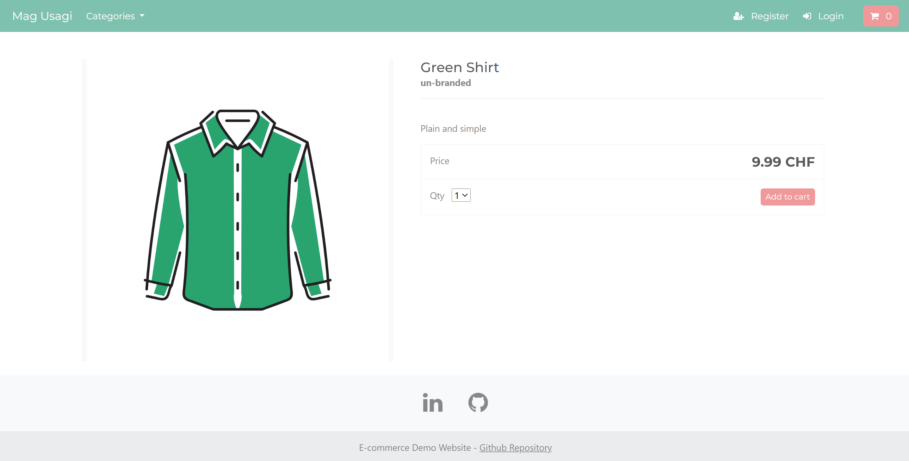

# E-commerce Project with Django - README

## Website
[Visit the E-commerce Site](https://store.magusagi.com/)
(Note: It may take some time for the website to load. Please be patient.)


## Overview
This project is a fully-featured e-commerce application built with Django. It includes essential functionalities for an e-commerce platform such as user management, shopping cart, payment integration, and cloud deployment. This project serves as a portfolio piece, demonstrating my skills in web development and cloud deployment.





## Technologies Used
- **Django**: Web framework
- **PayPal**: Payment processing
- **Amazon S3**: Storage
- **Amazon RDS**: Database
- **Render**: Deployment platform
- **AWS Elastic Beanstalk**: Initial deployment configuration
- **Bootstrap**: UI/UX design

## Notable Technologies
- **AWS Integration**: Utilized Amazon Web Services for storage (Amazon S3) and database (Amazon RDS).
- **Secure Password Management**: Implemented secure password management features.
- **Context Processors**: Used context processors for efficient data handling in Django.
- **AJAX**: Improved website performance and user experience with AJAX.

## Features

### Admin:
- Manage, edit, and add user, product, and order information.
- Administrative dashboard for overseeing all aspects of the e-commerce site.

### Shopping Cart Development:
- Comprehensive shopping cart functionality including item addition, updating, and deletion.
- Session management to retain cart information for returning users.
- Enhanced user experience with AJAX for cart actions.

### User Management:
- Email verification during user registration using token generators.
- Login functionality with restricted page access (e.g., dashboard) for authenticated users only.
- Password reset functionality with email verification.
- Address management for users to save shipping information, auto-filled during checkout.
- Dashboard for users to edit and delete their information.

### Payment Integration:
- Implemented PayPal API for payment processing.
- Tested using PayPal Sandbox to ensure functionality.

## Reference
This project is based on a tutorial by Arno Pretorius:
[Arno Pretorius' Udemy Course](https://www.udemy.com/share/107Wr23@Rq8rntm5ZRbDIhhfIqreU4Saa771oUKQ6tLSOe7hVaooqFJ81D3sTZq0tjWlCCF9jA==/)

## Deployment Steps
The application is deployed using Render. Below are the steps to deploy the application:

1. **Clone the Repository**:
    ```bash
    git clone https://github.com/yourusername/your-repo.git
    cd your-repo
    ```

2. **Install Dependencies**:
    ```bash
    pip install -r requirements.txt
    ```

3. **Setup Environment Variables**:
    Create a `.env` file in the root directory and add the necessary environment variables (e.g., database credentials, secret keys).

4. **Migrate Database**:
    ```bash
    python manage.py migrate
    ```

5. **Collect Static Files**:
    ```bash
    python manage.py collectstatic
    ```

6. **Run the Application**:
    ```bash
    python manage.py runserver
    ```

7. **Deploy to Render**:
    - Create a new web service in Render.
    - Connect your repository.
    - Configure the build and start commands:
      - **Build Command**: `pip install -r requirements.txt && python manage.py collectstatic --noinput && python manage.py migrate`
      - **Start Command**: `gunicorn your_project_name.wsgi`

    - Add environment variables in Render's dashboard.
    - Deploy the application.

Feel free to contact me for any further information or clarifications.
